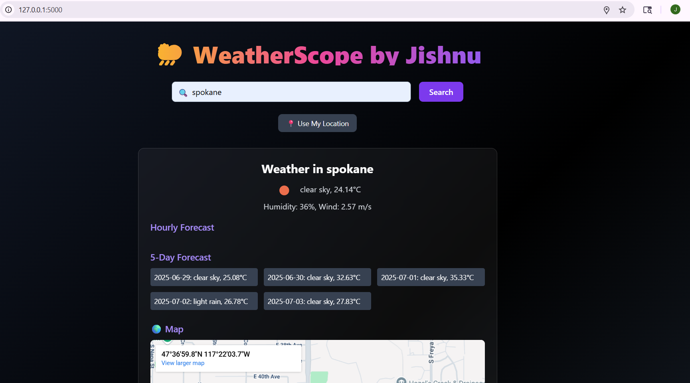

# 🌦️ Advanced Weather App

A full-stack, feature-rich weather application built using **Flask**, **MongoDB**, and **Vanilla JavaScript**, styled with **Tailwind CSS**. It allows users to search for weather data by city name or current geolocation, view a 5-day forecast, watch relevant YouTube travel videos, and visualize the location on a Google Map. This project was developed as part of the **PM Accelerator** program.

---

## 🌟 Features

- 🌍 Search by city, zip code, or landmark
- 📍 Geolocation support (use my location)
- 🌡️ Current weather display with icon, temperature, humidity, wind speed
- 📆 5-Day Forecast + ⏱️ Hourly forecast
- 📹 Embedded YouTube travel videos
- 🗺️ Google Maps city visualization
- 🔄 Full CRUD support via MongoDB
- 🧠 Autocomplete city search with GeoDB
- 📤 Export weather data in JSON, CSV, PDF
- 🌗 Modern dark UI with Tailwind CSS
- 🔒 Secure API key management using `.env`

---

## 📂 Project Structure

```
weather_app_advanced/
│
├── app.py                  # Flask backend, all routes and logic
├── .env                    # Environment variables (API keys, Mongo URI)
├── requirements.txt        # Python dependencies
│
├── templates/
│   └── index.html          # Main HTML frontend template (Jinja2)
│
├── static/
│   ├── script.js           # JavaScript for frontend behavior
│   └── style.css (optional)
├── screenshots/
│   ├── main_page.png
├── .gitignore
└── README.md               # Project documentation (this file)
```

---

## 🚀 How It Works

### 1. `app.py` (Flask Backend)

- Handles routing (`/`, `/weather`, `/youtube`, `/autocomplete`, `/export/*`)
- Fetches weather and forecast data from **OpenWeatherMap API**
- Retrieves video data from **YouTube Data API**
- Embeds map using **Google Maps Embed API**
- Connects to **MongoDB Atlas** for storing past searches
- Supports exporting weather entries in JSON, CSV formats
- Includes auto-suggestion support using **GeoDB API**

### 2. `index.html` (Frontend UI)

- Built with **Tailwind CSS**
- Dynamic UI updated via `script.js`
- Sections include:
  - Search Bar + Geolocation button
  - Weather result panel
  - Forecast grid
  - Travel videos
  - Google map
  - About modal popup

### 3. `script.js` (Client-Side Logic)

- Handles form submissions and geolocation
- Sends AJAX requests to Flask routes
- Updates UI with results (current weather, forecast, map, videos)
- Includes autocomplete functionality

### 4. `.env` (Secure API Keys)

Contains sensitive keys used by the backend:

```
OPENWEATHER_API_KEY=your_openweathermap_api_key
YOUTUBE_API_KEY=your_youtube_data_api_key
GOOGLE_MAPS_KEY=your_google_maps_api_key
GEODB_API_KEY=your_geodb_api_key
MONGO_URI=your_mongodb_connection_string
```

---

## 🧪 Technologies Used

| Stack            | Technology              |
|------------------|--------------------------|
| Backend          | Flask (Python)           |
| Frontend         | HTML, Tailwind CSS       |
| Database         | MongoDB Atlas            |
| APIs Used        | OpenWeatherMap, YouTube, Google Maps, GeoDB |
| Deployment Ready | Gunicorn, Heroku/AWS/Fly.io compatible |

---

## 🛠️ Setup Instructions

### Prerequisites
- Python 3.7+
- Git
- MongoDB Atlas account
- API keys (see `.env`)

### Clone the repo

```bash
git clone https://github.com/YOUR_USERNAME/weather_app_advanced.git
cd weather_app_advanced
```

### Create virtual environment

```bash
python -m venv venv
source venv/bin/activate  # On Windows: venv\Scripts\activate
```

### Install dependencies

```bash
pip install -r requirements.txt
```

### Add `.env` file

Create a `.env` in the root:

```env
OPENWEATHER_API_KEY=your_api
YOUTUBE_API_KEY=your_api
GOOGLE_MAPS_KEY=your_api
GEODB_API_KEY=your_api
MONGO_URI=your_mongodb_uri
```

### Run the app

```bash
python app.py
```

App will run on `http://127.0.0.1:5000`

---

## 📸 Screenshots

| Search UI | Forecast & Map |
|-----------|----------------|
|  |  |

---

## 🌐 APIs Used

| API              | Description                          |
|------------------|--------------------------------------|
| OpenWeatherMap   | Current and 5-day forecast           |
| GeoDB            | City autocomplete suggestions       |
| YouTube Data API | City-related travel videos          |
| Google Maps Embed| Map embedding for cities            |

---

## 📧 Contact

Built with ❤️ by **Jishnuvardhan Karpuram**  
[LinkedIn](https://www.linkedin.com/in/jishnuvardhan-karpuram) • [GitHub](https://github.com/jishnu6999)

---

## 🧠 Acknowledgements

- PM Accelerator Team 🚀  
- Tailwind CSS Docs  
- Flask & MongoDB Communities  
- OpenWeatherMap, YouTube & Google Maps APIs
